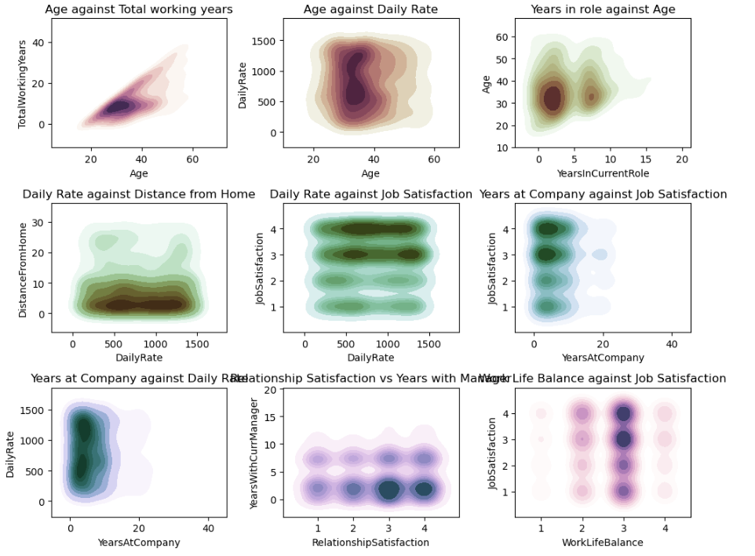
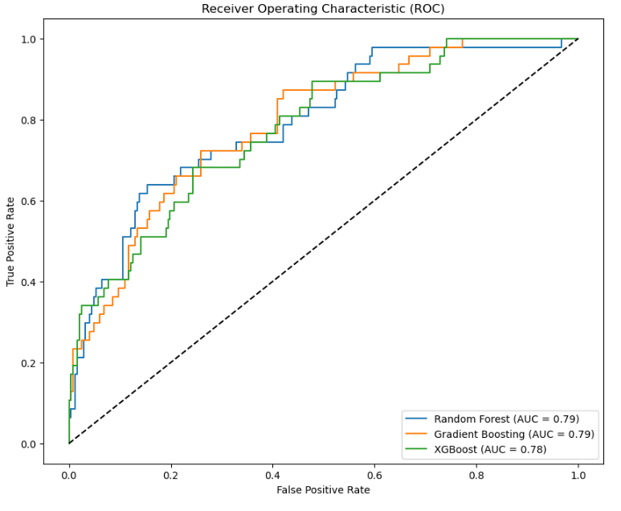

# Employee Attrition Analysis

## Project Overview

This project provides a comprehensive analysis of employee attrition using machine learning techniques. The goal is to understand and predict employee turnover based on various features in the dataset.

## Getting Started

To run this project, ensure you have the following dependencies installed: [requirements.txt](requirements.txt)

## Usage

1. **Clone the Repository**:

   ```bash
   git clone https://github.com/arindal1/employee-attrition-analysis.git
   cd employee-attrition-analysis
   ```

2. **Run the Script**:

   Execute the script to perform data analysis and model training:

   ```bash
   python main.py
   ```

   **OR**

   Checkout the **Jupyter Notebook** file [EmployeeAttrition.ipynb](EmployeeAttrition.ipynb).

## Results




```markdown
Gradient Boosting Accuracy score: 0.8673469387755102
=====================================================
              precision    recall  f1-score   support

           0       0.87      0.99      0.93       247
           1       0.83      0.21      0.34        47

    accuracy                           0.87       294
   macro avg       0.85      0.60      0.63       294
weighted avg       0.86      0.87      0.83       294
```

- **Random Forest Accuracy**: 0.86
- **Gradient Boosting Accuracy**: 0.87
- **XGBoost Accuracy**: 0.86

The final XGBoost model, trained with the best parameters from Grid Search, achieved an accuracy of 0.86 on the test set.

## Contact

For more information, feel free to connect with me:

- [GitHub](https://github.com/arindal1)
- [LinkedIn](https://www.linkedin.com/in/arindalchar)
- [Twitter](https://twitter.com/arindal_17)

## License

This project is licensed under the [MIT License](LICENSE).

---

### Keep Coding! 🚀